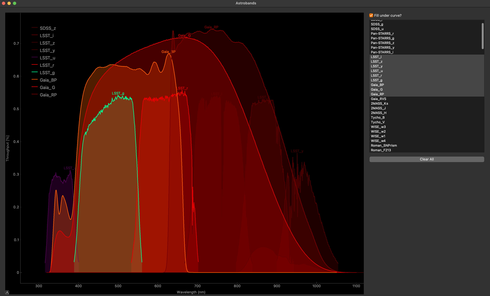

# Astrobands

Visualise passbands of common astronomy filters from observatories.

Inspired by the need to visually compare the wavelengths observable from various observatories, the passbands have been taken from various institutions and collated for convenience. The lines are presented as an approximate visual colour for the peak wavelength. The code allows for new bands to be added easily.

To do:
- Add mouse curser readout of wavelength
- load an SED to compare throughput