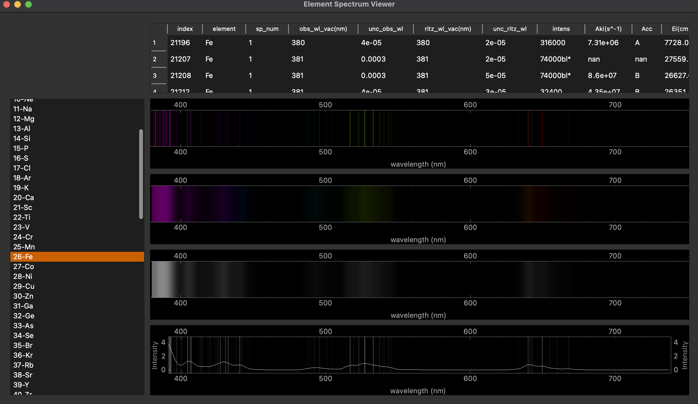

# Element Spectra

Use NIST element lines and intensities to produce reference and mock spectra.

scrape_nist.py allows for you to query the **[NIST website](https://physics.nist.gov/PhysRefData/ASD/lines_form.html)** for each element and save the data as numpy files (quick to load and compressed compared to ascii/csv).

elementviewer.py loads the available NIST numpy files and presents the lines as spectra in the visible light range. It also produces mock 2D spectra with an applied vertical and 2D point spread function. Finally it then colapses the mock spectra back into 1D profile.

To do:
- Add psf controls to mock spectra
- Add redshift